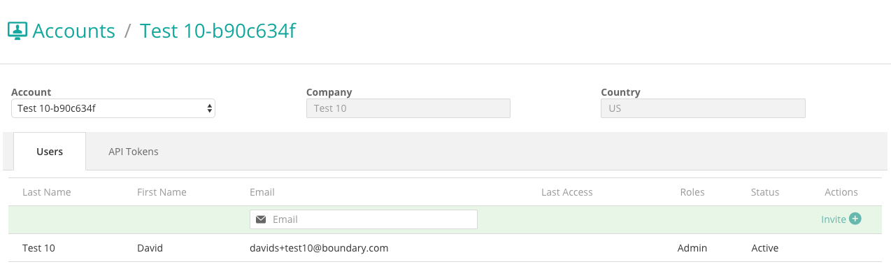

# Sample from an Account Management Application using Angular 1.3.3 - David Shaevel

### 05/09/2016

---

## Description
A coding sample of some Angular 1.x components and tests:

* Controllers:

  `app/scripts/controllers/`

* Directives:

  `app/scripts/directives/`

* Factories:

  `app/scripts/factories/`

* View Templates:

  `app/views/`

* Test Specs:

  `test/spec/`

* Test Fixtures:

  `test/fixtures/`

## Screenshot:

